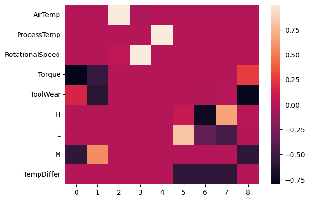
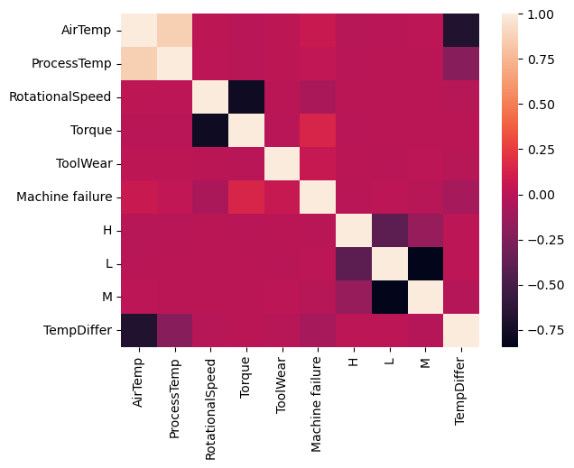
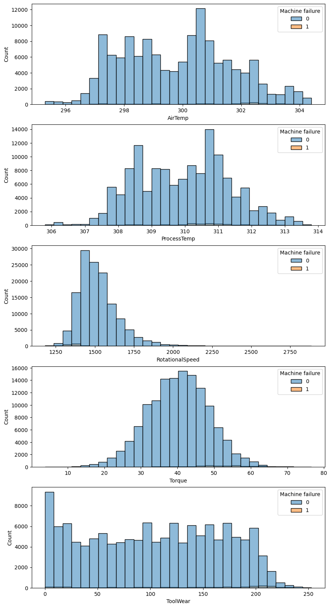
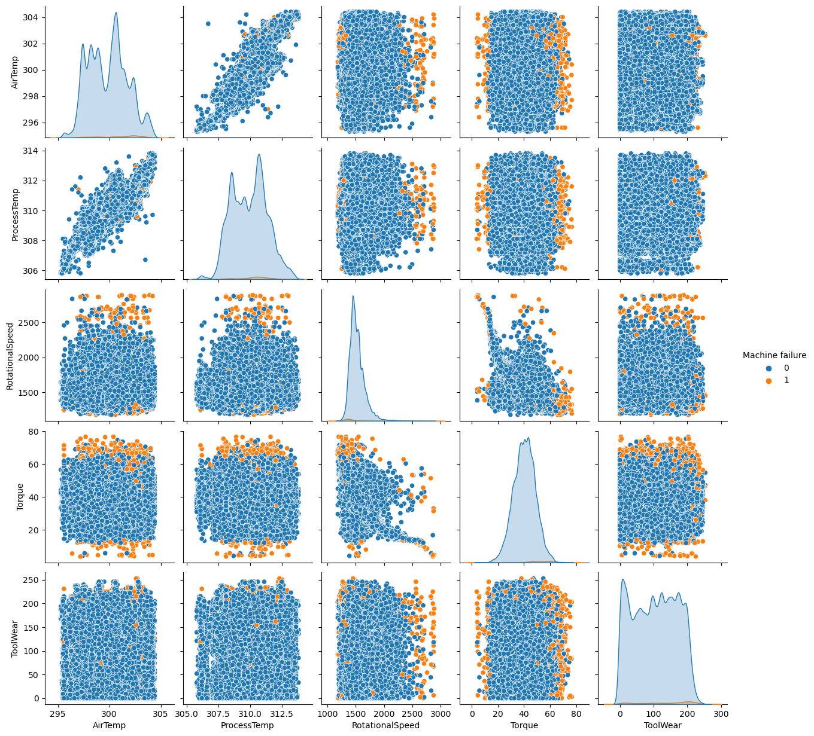
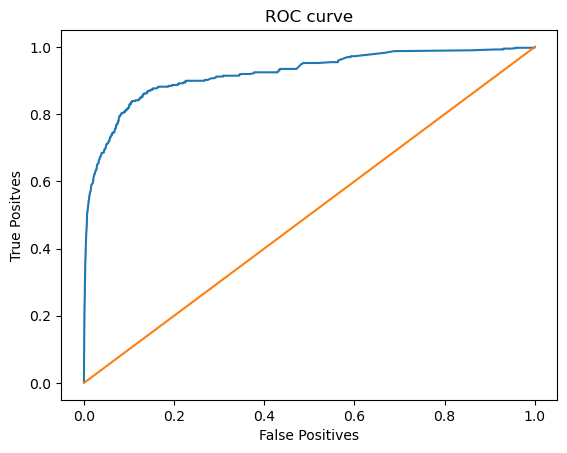

# 1. Importing Modules


```python
import pandas as pd
import seaborn as sns
import matplotlib.pyplot as plt
from sklearn.preprocessing import OneHotEncoder
from sklearn.model_selection import train_test_split
from sklearn.feature_selection import mutual_info_regression
from sklearn.decomposition import PCA
from xgboost import XGBRegressor
from sklearn.metrics import mean_absolute_error
```

# 2. Loading Data


```python
train_data = pd.read_csv('/kaggle/input/playground-series-s3e17/train.csv', index_col=0)
test_data = pd.read_csv('/kaggle/input/playground-series-s3e17/test.csv', index_col=0)
```


```python
train_data.head()
```


<div>
<table border="1" class="dataframe">
  <thead>
    <tr style="text-align: right;">
      <th></th>
      <th>Product ID</th>
      <th>Type</th>
      <th>Air temperature [K]</th>
      <th>Process temperature [K]</th>
      <th>Rotational speed [rpm]</th>
      <th>Torque [Nm]</th>
      <th>Tool wear [min]</th>
      <th>Machine failure</th>
      <th>TWF</th>
      <th>HDF</th>
      <th>PWF</th>
      <th>OSF</th>
      <th>RNF</th>
    </tr>
    <tr>
      <th>id</th>
      <th></th>
      <th></th>
      <th></th>
      <th></th>
      <th></th>
      <th></th>
      <th></th>
      <th></th>
      <th></th>
      <th></th>
      <th></th>
      <th></th>
      <th></th>
    </tr>
  </thead>
  <tbody>
    <tr>
      <th>0</th>
      <td>L50096</td>
      <td>L</td>
      <td>300.6</td>
      <td>309.6</td>
      <td>1596</td>
      <td>36.1</td>
      <td>140</td>
      <td>0</td>
      <td>0</td>
      <td>0</td>
      <td>0</td>
      <td>0</td>
      <td>0</td>
    </tr>
    <tr>
      <th>1</th>
      <td>M20343</td>
      <td>M</td>
      <td>302.6</td>
      <td>312.1</td>
      <td>1759</td>
      <td>29.1</td>
      <td>200</td>
      <td>0</td>
      <td>0</td>
      <td>0</td>
      <td>0</td>
      <td>0</td>
      <td>0</td>
    </tr>
    <tr>
      <th>2</th>
      <td>L49454</td>
      <td>L</td>
      <td>299.3</td>
      <td>308.5</td>
      <td>1805</td>
      <td>26.5</td>
      <td>25</td>
      <td>0</td>
      <td>0</td>
      <td>0</td>
      <td>0</td>
      <td>0</td>
      <td>0</td>
    </tr>
    <tr>
      <th>3</th>
      <td>L53355</td>
      <td>L</td>
      <td>301.0</td>
      <td>310.9</td>
      <td>1524</td>
      <td>44.3</td>
      <td>197</td>
      <td>0</td>
      <td>0</td>
      <td>0</td>
      <td>0</td>
      <td>0</td>
      <td>0</td>
    </tr>
    <tr>
      <th>4</th>
      <td>M24050</td>
      <td>M</td>
      <td>298.0</td>
      <td>309.0</td>
      <td>1641</td>
      <td>35.4</td>
      <td>34</td>
      <td>0</td>
      <td>0</td>
      <td>0</td>
      <td>0</td>
      <td>0</td>
      <td>0</td>
    </tr>
  </tbody>
</table>
</div>


# 3. Prepping Data


```python
def preprocess_data(data):
    # Dropping some columns
    drop_cols = ['TWF','HDF','PWF','OSF','RNF', 'Product ID']
    data.drop(drop_cols, axis=1, inplace=True)
    
    # One-Hot-Encoding the Type column
    OH_encoder = OneHotEncoder(sparse_output=False)
    OH_type = OH_encoder.fit_transform(data.Type.array.reshape(-1, 1))
    cats = OH_encoder.categories_[0]
    OH_type = pd.DataFrame(OH_type, index=data.index, columns=cats)
    
    # Adding the new one-hot-encoded Type to the data
    new_data = pd.concat([data, OH_type], axis=1)
    new_data.drop('Type', inplace=True, axis=1)
    
    # Renaming the columns
    col_names = {
        'Air temperature [K]':'AirTemp', 
        'Process temperature [K]':'ProcessTemp', 
        'Rotational speed [rpm]':'RotationalSpeed', 
        'Torque [Nm]':'Torque', 
        'Tool wear [min]':'ToolWear'}
    new_data.rename(columns=col_names, inplace=True)
    
    return new_data
```


```python
prepped_train_data = preprocess_data(train_data)
prepped_test_data = preprocess_data(test_data)
prepped_train_data
```


<div>
<table border="1" class="dataframe">
  <thead>
    <tr style="text-align: right;">
      <th></th>
      <th>AirTemp</th>
      <th>ProcessTemp</th>
      <th>RotationalSpeed</th>
      <th>Torque</th>
      <th>ToolWear</th>
      <th>Machine failure</th>
      <th>H</th>
      <th>L</th>
      <th>M</th>
    </tr>
    <tr>
      <th>id</th>
      <th></th>
      <th></th>
      <th></th>
      <th></th>
      <th></th>
      <th></th>
      <th></th>
      <th></th>
      <th></th>
    </tr>
  </thead>
  <tbody>
    <tr>
      <th>0</th>
      <td>300.6</td>
      <td>309.6</td>
      <td>1596</td>
      <td>36.1</td>
      <td>140</td>
      <td>0</td>
      <td>0.0</td>
      <td>1.0</td>
      <td>0.0</td>
    </tr>
    <tr>
      <th>1</th>
      <td>302.6</td>
      <td>312.1</td>
      <td>1759</td>
      <td>29.1</td>
      <td>200</td>
      <td>0</td>
      <td>0.0</td>
      <td>0.0</td>
      <td>1.0</td>
    </tr>
    <tr>
      <th>2</th>
      <td>299.3</td>
      <td>308.5</td>
      <td>1805</td>
      <td>26.5</td>
      <td>25</td>
      <td>0</td>
      <td>0.0</td>
      <td>1.0</td>
      <td>0.0</td>
    </tr>
    <tr>
      <th>3</th>
      <td>301.0</td>
      <td>310.9</td>
      <td>1524</td>
      <td>44.3</td>
      <td>197</td>
      <td>0</td>
      <td>0.0</td>
      <td>1.0</td>
      <td>0.0</td>
    </tr>
    <tr>
      <th>4</th>
      <td>298.0</td>
      <td>309.0</td>
      <td>1641</td>
      <td>35.4</td>
      <td>34</td>
      <td>0</td>
      <td>0.0</td>
      <td>0.0</td>
      <td>1.0</td>
    </tr>
    <tr>
      <th>...</th>
      <td>...</td>
      <td>...</td>
      <td>...</td>
      <td>...</td>
      <td>...</td>
      <td>...</td>
      <td>...</td>
      <td>...</td>
      <td>...</td>
    </tr>
    <tr>
      <th>136424</th>
      <td>300.1</td>
      <td>311.4</td>
      <td>1530</td>
      <td>37.5</td>
      <td>210</td>
      <td>0</td>
      <td>0.0</td>
      <td>0.0</td>
      <td>1.0</td>
    </tr>
    <tr>
      <th>136425</th>
      <td>297.5</td>
      <td>308.5</td>
      <td>1447</td>
      <td>49.1</td>
      <td>2</td>
      <td>0</td>
      <td>1.0</td>
      <td>0.0</td>
      <td>0.0</td>
    </tr>
    <tr>
      <th>136426</th>
      <td>300.5</td>
      <td>311.8</td>
      <td>1524</td>
      <td>38.5</td>
      <td>214</td>
      <td>0</td>
      <td>0.0</td>
      <td>1.0</td>
      <td>0.0</td>
    </tr>
    <tr>
      <th>136427</th>
      <td>301.7</td>
      <td>310.9</td>
      <td>1447</td>
      <td>46.3</td>
      <td>42</td>
      <td>0</td>
      <td>0.0</td>
      <td>1.0</td>
      <td>0.0</td>
    </tr>
    <tr>
      <th>136428</th>
      <td>296.9</td>
      <td>308.1</td>
      <td>1557</td>
      <td>39.3</td>
      <td>229</td>
      <td>0</td>
      <td>0.0</td>
      <td>1.0</td>
      <td>0.0</td>
    </tr>
  </tbody>
</table>
<p>136429 rows × 9 columns</p>
</div>


```python
prepped_train_data.describe()
```


<div>
<table border="1" class="dataframe">
  <thead>
    <tr style="text-align: right;">
      <th></th>
      <th>AirTemp</th>
      <th>ProcessTemp</th>
      <th>RotationalSpeed</th>
      <th>Torque</th>
      <th>ToolWear</th>
      <th>Machine failure</th>
      <th>H</th>
      <th>L</th>
      <th>M</th>
    </tr>
  </thead>
  <tbody>
    <tr>
      <th>count</th>
      <td>136429.000000</td>
      <td>136429.000000</td>
      <td>136429.000000</td>
      <td>136429.000000</td>
      <td>136429.000000</td>
      <td>136429.000000</td>
      <td>136429.000000</td>
      <td>136429.000000</td>
      <td>136429.000000</td>
    </tr>
    <tr>
      <th>mean</th>
      <td>299.862776</td>
      <td>309.941070</td>
      <td>1520.331110</td>
      <td>40.348643</td>
      <td>104.408901</td>
      <td>0.015744</td>
      <td>0.065404</td>
      <td>0.698928</td>
      <td>0.235668</td>
    </tr>
    <tr>
      <th>std</th>
      <td>1.862247</td>
      <td>1.385173</td>
      <td>138.736632</td>
      <td>8.502229</td>
      <td>63.965040</td>
      <td>0.124486</td>
      <td>0.247238</td>
      <td>0.458726</td>
      <td>0.424417</td>
    </tr>
    <tr>
      <th>min</th>
      <td>295.300000</td>
      <td>305.800000</td>
      <td>1181.000000</td>
      <td>3.800000</td>
      <td>0.000000</td>
      <td>0.000000</td>
      <td>0.000000</td>
      <td>0.000000</td>
      <td>0.000000</td>
    </tr>
    <tr>
      <th>25%</th>
      <td>298.300000</td>
      <td>308.700000</td>
      <td>1432.000000</td>
      <td>34.600000</td>
      <td>48.000000</td>
      <td>0.000000</td>
      <td>0.000000</td>
      <td>0.000000</td>
      <td>0.000000</td>
    </tr>
    <tr>
      <th>50%</th>
      <td>300.000000</td>
      <td>310.000000</td>
      <td>1493.000000</td>
      <td>40.400000</td>
      <td>106.000000</td>
      <td>0.000000</td>
      <td>0.000000</td>
      <td>1.000000</td>
      <td>0.000000</td>
    </tr>
    <tr>
      <th>75%</th>
      <td>301.200000</td>
      <td>310.900000</td>
      <td>1580.000000</td>
      <td>46.100000</td>
      <td>159.000000</td>
      <td>0.000000</td>
      <td>0.000000</td>
      <td>1.000000</td>
      <td>0.000000</td>
    </tr>
    <tr>
      <th>max</th>
      <td>304.400000</td>
      <td>313.800000</td>
      <td>2886.000000</td>
      <td>76.600000</td>
      <td>253.000000</td>
      <td>1.000000</td>
      <td>1.000000</td>
      <td>1.000000</td>
      <td>1.000000</td>
    </tr>
  </tbody>
</table>
</div>


# 6. Adding new features


```python
prepped_train_data['TempDiffer'] = prepped_train_data['ProcessTemp'] - prepped_train_data['AirTemp']
prepped_test_data['TempDiffer'] = prepped_test_data['ProcessTemp'] - prepped_test_data['AirTemp']
prepped_train_data.head()
```


<div>
<table border="1" class="dataframe">
  <thead>
    <tr style="text-align: right;">
      <th></th>
      <th>AirTemp</th>
      <th>ProcessTemp</th>
      <th>RotationalSpeed</th>
      <th>Torque</th>
      <th>ToolWear</th>
      <th>Machine failure</th>
      <th>H</th>
      <th>L</th>
      <th>M</th>
      <th>TempDiffer</th>
    </tr>
    <tr>
      <th>id</th>
      <th></th>
      <th></th>
      <th></th>
      <th></th>
      <th></th>
      <th></th>
      <th></th>
      <th></th>
      <th></th>
      <th></th>
    </tr>
  </thead>
  <tbody>
    <tr>
      <th>0</th>
      <td>300.6</td>
      <td>309.6</td>
      <td>1596</td>
      <td>36.1</td>
      <td>140</td>
      <td>0</td>
      <td>0.0</td>
      <td>1.0</td>
      <td>0.0</td>
      <td>9.0</td>
    </tr>
    <tr>
      <th>1</th>
      <td>302.6</td>
      <td>312.1</td>
      <td>1759</td>
      <td>29.1</td>
      <td>200</td>
      <td>0</td>
      <td>0.0</td>
      <td>0.0</td>
      <td>1.0</td>
      <td>9.5</td>
    </tr>
    <tr>
      <th>2</th>
      <td>299.3</td>
      <td>308.5</td>
      <td>1805</td>
      <td>26.5</td>
      <td>25</td>
      <td>0</td>
      <td>0.0</td>
      <td>1.0</td>
      <td>0.0</td>
      <td>9.2</td>
    </tr>
    <tr>
      <th>3</th>
      <td>301.0</td>
      <td>310.9</td>
      <td>1524</td>
      <td>44.3</td>
      <td>197</td>
      <td>0</td>
      <td>0.0</td>
      <td>1.0</td>
      <td>0.0</td>
      <td>9.9</td>
    </tr>
    <tr>
      <th>4</th>
      <td>298.0</td>
      <td>309.0</td>
      <td>1641</td>
      <td>35.4</td>
      <td>34</td>
      <td>0</td>
      <td>0.0</td>
      <td>0.0</td>
      <td>1.0</td>
      <td>11.0</td>
    </tr>
  </tbody>
</table>
</div>


# 4. Spliting Data


```python
X=prepped_train_data.drop(['Machine failure'], axis=1)
y=prepped_train_data['Machine failure']
```


```python
X_train, X_valid, y_train, y_valid = train_test_split(X, y, test_size=0.2, random_state=99)
```

# 5. Analysing Features


```python
mi_scores= mutual_info_regression(X, y)
mi_scores_series = pd.Series(mi_scores, name='MI scores', index=X.columns)
mi_scores_series.sort_values(ascending=False)
```


    Torque             0.021782
    RotationalSpeed    0.015154
    TempDiffer         0.007294
    ToolWear           0.004929
    AirTemp            0.004925
    ProcessTemp        0.002126
    M                  0.000677
    H                  0.000000
    L                  0.000000
    Name: MI scores, dtype: float64


```python
pca=PCA()
X_pca = pca.fit_transform(X_train)
X_pca_components = pd.DataFrame(pca.components_, index=X_train.columns)
X_pca_components
```


<div>
<table border="1" class="dataframe">
  <thead>
    <tr style="text-align: right;">
      <th></th>
      <th>0</th>
      <th>1</th>
      <th>2</th>
      <th>3</th>
      <th>4</th>
      <th>5</th>
      <th>6</th>
      <th>7</th>
      <th>8</th>
    </tr>
  </thead>
  <tbody>
    <tr>
      <th>AirTemp</th>
      <td>0.000243</td>
      <td>0.000132</td>
      <td>9.988607e-01</td>
      <td>-4.765407e-02</td>
      <td>2.520727e-03</td>
      <td>0.000003</td>
      <td>-0.000004</td>
      <td>0.000002</td>
      <td>-0.000111</td>
    </tr>
    <tr>
      <th>ProcessTemp</th>
      <td>0.000494</td>
      <td>0.000248</td>
      <td>-2.521373e-03</td>
      <td>5.033723e-05</td>
      <td>9.999966e-01</td>
      <td>0.000015</td>
      <td>-0.000055</td>
      <td>0.000040</td>
      <td>-0.000246</td>
    </tr>
    <tr>
      <th>RotationalSpeed</th>
      <td>0.004191</td>
      <td>0.001422</td>
      <td>4.765190e-02</td>
      <td>9.988504e-01</td>
      <td>6.676347e-05</td>
      <td>-0.000072</td>
      <td>-0.000005</td>
      <td>0.000077</td>
      <td>-0.002769</td>
    </tr>
    <tr>
      <th>Torque</th>
      <td>-0.801315</td>
      <td>-0.536329</td>
      <td>5.243256e-04</td>
      <td>4.835591e-03</td>
      <td>5.951679e-04</td>
      <td>0.000984</td>
      <td>0.000778</td>
      <td>-0.001762</td>
      <td>0.264985</td>
    </tr>
    <tr>
      <th>ToolWear</th>
      <td>0.156622</td>
      <td>-0.615604</td>
      <td>-1.340616e-04</td>
      <td>-1.915458e-03</td>
      <td>-1.153781e-04</td>
      <td>-0.001484</td>
      <td>-0.008262</td>
      <td>0.009746</td>
      <td>-0.772226</td>
    </tr>
    <tr>
      <th>H</th>
      <td>-0.003296</td>
      <td>0.006797</td>
      <td>-4.139783e-06</td>
      <td>-1.716147e-05</td>
      <td>-6.644867e-05</td>
      <td>0.079459</td>
      <td>-0.743423</td>
      <td>0.663965</td>
      <td>0.010093</td>
    </tr>
    <tr>
      <th>L</th>
      <td>0.001579</td>
      <td>-0.001139</td>
      <td>6.580431e-07</td>
      <td>8.110767e-05</td>
      <td>-1.228493e-05</td>
      <td>0.812619</td>
      <td>-0.337519</td>
      <td>-0.475100</td>
      <td>-0.002718</td>
    </tr>
    <tr>
      <th>M</th>
      <td>-0.577350</td>
      <td>0.577350</td>
      <td>-0.000000e+00</td>
      <td>-3.122502e-17</td>
      <td>-1.110223e-16</td>
      <td>-0.000727</td>
      <td>-0.000727</td>
      <td>-0.000727</td>
      <td>-0.577350</td>
    </tr>
    <tr>
      <th>TempDiffer</th>
      <td>0.000727</td>
      <td>-0.000727</td>
      <td>-3.144186e-18</td>
      <td>-5.825215e-17</td>
      <td>2.168404e-19</td>
      <td>-0.577350</td>
      <td>-0.577350</td>
      <td>-0.577350</td>
      <td>0.000727</td>
    </tr>
  </tbody>
</table>
</div>


```python
sns.heatmap(X_pca_components)
```


    <Axes: >


    

    


```python
sns.heatmap(prepped_train_data.corr())
```


    <Axes: >


    

    


```python
prepped_train_data.columns
```


    Index(['AirTemp', 'ProcessTemp', 'RotationalSpeed', 'Torque', 'ToolWear',
           'Machine failure', 'H', 'L', 'M', 'TempDiffer'],
          dtype='object')


```python
y.value_counts()
```


    0    134281
    1      2148
    Name: Machine failure, dtype: int64


```python
figure, axes = plt.subplots(5, 1, figsize=(10,20))
sns.histplot(x='AirTemp', data=prepped_train_data, bins=30, hue='Machine failure', ax=axes[0])
sns.histplot(x='ProcessTemp', data=prepped_train_data, bins=30, hue='Machine failure', ax=axes[1])
sns.histplot(x='RotationalSpeed', data=prepped_train_data, bins=30, hue='Machine failure', ax=axes[2])
sns.histplot(x='Torque', data=prepped_train_data, bins=30, hue='Machine failure', ax=axes[3])
sns.histplot(x='ToolWear', data=prepped_train_data, bins=30, hue='Machine failure', ax=axes[4])
```


    <Axes: xlabel='ToolWear', ylabel='Count'>


    

    


```python
sns.pairplot(prepped_train_data, vars=['AirTemp', 'ProcessTemp', 'RotationalSpeed', 'Torque', 'ToolWear'], hue='Machine failure')
```


    <seaborn.axisgrid.PairGrid at 0x7b506a3bca30>


    

    


# 7. Model Training


```python
model = XGBRegressor(n_estimators=3000, learning_rate=0.003)
model.fit(X_train, y_train, 
          early_stopping_rounds=5, 
          eval_set=[(X_valid, y_valid)], verbose=30)
```

    [0]	validation_0-rmse:0.49856
    

    /opt/conda/lib/python3.10/site-packages/xgboost/sklearn.py:835: UserWarning: `early_stopping_rounds` in `fit` method is deprecated for better compatibility with scikit-learn, use `early_stopping_rounds` in constructor or`set_params` instead.
      warnings.warn(
    

    [30]	validation_0-rmse:0.45755
    [60]	validation_0-rmse:0.42024
    [90]	validation_0-rmse:0.38633
    [120]	validation_0-rmse:0.35554
    [150]	validation_0-rmse:0.32760
    [180]	validation_0-rmse:0.30230
    [210]	validation_0-rmse:0.27942
    [240]	validation_0-rmse:0.25876
    [270]	validation_0-rmse:0.24014
    [300]	validation_0-rmse:0.22334
    [330]	validation_0-rmse:0.20827
    [360]	validation_0-rmse:0.19479
    [390]	validation_0-rmse:0.18276
    [420]	validation_0-rmse:0.17205
    [450]	validation_0-rmse:0.16257
    [480]	validation_0-rmse:0.15420
    [510]	validation_0-rmse:0.14684
    [540]	validation_0-rmse:0.14041
    [570]	validation_0-rmse:0.13480
    [600]	validation_0-rmse:0.12991
    [630]	validation_0-rmse:0.12567
    [660]	validation_0-rmse:0.12204
    [690]	validation_0-rmse:0.11891
    [720]	validation_0-rmse:0.11623
    [750]	validation_0-rmse:0.11395
    [780]	validation_0-rmse:0.11200
    [810]	validation_0-rmse:0.11034
    [840]	validation_0-rmse:0.10892
    [870]	validation_0-rmse:0.10773
    [900]	validation_0-rmse:0.10672
    [930]	validation_0-rmse:0.10584
    [960]	validation_0-rmse:0.10509
    [990]	validation_0-rmse:0.10447
    [1020]	validation_0-rmse:0.10393
    [1050]	validation_0-rmse:0.10345
    [1080]	validation_0-rmse:0.10305
    [1110]	validation_0-rmse:0.10273
    [1140]	validation_0-rmse:0.10244
    [1170]	validation_0-rmse:0.10221
    [1200]	validation_0-rmse:0.10201
    [1230]	validation_0-rmse:0.10184
    [1260]	validation_0-rmse:0.10171
    [1290]	validation_0-rmse:0.10157
    [1320]	validation_0-rmse:0.10147
    [1350]	validation_0-rmse:0.10136
    [1380]	validation_0-rmse:0.10127
    [1410]	validation_0-rmse:0.10120
    [1440]	validation_0-rmse:0.10114
    [1470]	validation_0-rmse:0.10109
    [1500]	validation_0-rmse:0.10104
    [1530]	validation_0-rmse:0.10101
    [1560]	validation_0-rmse:0.10098
    [1590]	validation_0-rmse:0.10095
    [1620]	validation_0-rmse:0.10092
    [1650]	validation_0-rmse:0.10089
    [1680]	validation_0-rmse:0.10087
    [1710]	validation_0-rmse:0.10085
    [1740]	validation_0-rmse:0.10084
    [1770]	validation_0-rmse:0.10084
    [1800]	validation_0-rmse:0.10083
    [1830]	validation_0-rmse:0.10082
    [1860]	validation_0-rmse:0.10081
    [1890]	validation_0-rmse:0.10080
    [1920]	validation_0-rmse:0.10080
    XGBRegressor(base_score=None, booster=None, callbacks=None,
             colsample_bylevel=None, colsample_bynode=None,
             colsample_bytree=None, early_stopping_rounds=None,
             enable_categorical=False, eval_metric=None, feature_types=None,
             gamma=None, gpu_id=None, grow_policy=None, importance_type=None,
             interaction_constraints=None, learning_rate=0.003, max_bin=None,
             max_cat_threshold=None, max_cat_to_onehot=None,
             max_delta_step=None, max_depth=None, max_leaves=None,
             min_child_weight=None, missing=nan, monotone_constraints=None,
             n_estimators=3000, n_jobs=None, num_parallel_tree=None,
             predictor=None, random_state=None, ...)


# 8. Scoring and Submission


```python
score = mean_absolute_error(y_valid, model.predict(X_valid))
score
```


    0.022236713043428454


```python
predictions = model.predict(prepped_test_data)
predictions = pd.DataFrame(predictions, index=prepped_test_data.index, columns=['Machine failure'])
```


```python
from sklearn.metrics import roc_curve
roc = roc_curve(y_valid, model.predict(X_valid))
```


```python
sns.lineplot(x=roc[0], y=roc[1]);
sns.lineplot(x=(0,1), y=(0,1));
plt.xlabel('False Positives');
plt.ylabel('True Positves');
plt.title('ROC curve');
```


    

    


```python
# predictions['Machine failure'] = (predictions['Machine failure'] > 0.5).astype(int)
```


```python
predictions.to_csv('submission.csv')
```

**THE END**
<br>[](
https://github.com/DuanBoomer)
